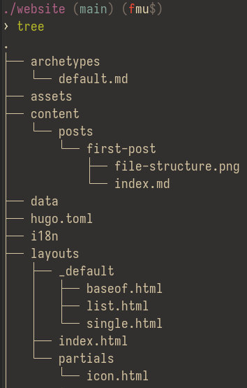

+++
title = 'Making a blog website with Hugo'
date = 2026-08-09T15:48:50-04:00
draft = false
+++

This post works through my 1-day process of installing Hugo, configuring it with a custom theme, and making _this_ blog post.

<!--more-->

# What is Hugo?

[Hugo](https://gohugo.io/) is known as a _static site generator_. It is used to make a wide assortment of different websites, but it seems popular to use in this exact case I am today- making a blog website.

Hugo was written in Golang and unlike usual websites that dynamically generate the page whenever someone visits it, Hugo generates the HTML ahead of time. This method makes it very nice to use with github pages.

The ability to write posts in markdown makes the speed, and ease of use for blogging miles easier than writing HTML. Another option that is officially supported by github pages is [Jekyll](https://jekyllrb.com/). I looked at it once and decided I didn't want to install [Ruby](https://www.ruby-lang.org/en/). Github does feature [documentation](https://docs.github.com/en/pages/setting-up-a-github-pages-site-with-jekyll) on using Jekyll themselves over Hugo though.

# The Process

I installed Hugo on my WSL2 Debian instance and immediately went to the documentation and read the [Quick-Start](
  https://gohugo.io/getting-started/quick-start/) guide. I found it a bit weird as I wanted to make my own theme so telling the person to clone _Ananke_ off-rip was annoying. I ended up asking ChatGPT to give me a personalized quick-start and it, of course, told me to generate a theme using `hugo new theme (name)`. To write custom CSS/HTML you do **NOT** need a theme module.

If you are deciding on making your own blog using Hugo and want to create your own theme, you only need the base file structure provided after running `hugo new website (web name)`. The general file structure isn't that difficult to understand. As an example, this is the structure behind this website:



I don't know what `archetypes`, `assets`, or `data` even are. Who needs those though? I didn't.

There are some things to note about this file structure:
- `content/posts/` is where all the posts go. Each post can be a separate folder where all assets/images reside, as well as the main `index.md` blog file (it needs to be named index.md, trust me bro).
- `_defaults/baseof.html` is the main HTML file, it contains all the links to stylesheets and the general structure of the website.
- `list.html` aswell as `single.html` are separate elements that get placed into the `baseof.html` file on a loop. The `list.html` is the list of posts under my full post list page. `single.html` is the HTML that makes this current page.
- The _partials_ are almost components as well, similar to the `list.html` and `single.html` but it's even smaller in scale. In my case, `icon.html` is used to only generate the icons on the status element at the bottom of these pages. The github/youtube icons specifically.

# Icons

Icons were a little interesting and made me learn something new about CSS/HTML. So interesting in fact that I'm dedicating a separate section to them.

*You'll have to scroll for this code snippet...*
```html
<svg viewBox="0 0 24 24" width="20" height="20" fill="currentColor" aria-hidden="true">
  <path d="M12 .5C5.73.5.5 5.73.5 12c0 5.08 3.29 9.39 7.86 10.91.57.1.78-.25.78-.55 0-.27-.01-1.16-.02-2.11-3.2.7-3.88-1.36-3.88-1.36-.52-1.33-1.28-1.68-1.28-1.68-1.04-.71.08-.7.08-.7 1.15.08 1.76 1.18 1.76 1.18 1.03 1.76 2.7 1.25 3.35.96.1-.75.4-1.25.73-1.54-2.55-.29-5.24-1.28-5.24-5.68 0-1.25.45-2.28 1.18-3.08-.12-.29-.51-1.46.11-3.04 0 0 .96-.31 3.15 1.18a10.9 10.9 0 0 1 5.74 0c2.19-1.49 3.15-1.18 3.15-1.18.62 1.58.23 2.75.11 3.04.74.8 1.18 1.83 1.18 3.08 0 4.41-2.7 5.38-5.27 5.67.42.36.78 1.08.78 2.17 0 1.57-.01 2.83-.01 3.22 0 .3.2.66.79.55A10.51 10.51 0 0 0 23.5 12C23.5 5.73 18.27.5 12 .5z"/>
</svg>
```

This HTML snippet defines the SVG _paths_ data for what to render. I had no idea this was possible. There might be a better way to do this but, this works so I'll stick with it. Together in junction with this icon-svg-rendering method, I specified some stuff in my `hugo.toml` file:

```toml
[[params.social]]
  name = "github"
  url = "https://github.com/komidan"

[[params.social]]
  name = "youtube"
  url = "https://youtube.com/@komidan_"
```

Rendering the icon is just reading the name field and adding in the SVG HTML element in-place. As I was making this, I was originally going to just leave them as plain text _youtube_ and _github_. It didn't look bad, but icons look a little more modern... right?

```html
{{ $name := .name }}
{{ if eq $name "github" }}
<svg viewBox="0 0 24 24" width="20" height="20" fill="currentColor" aria-hidden="true">
  <path d="(...)"/>
</svg>
{{ else if eq $name "youtube" }}
<svg viewBox="0 0 24 24" width="20" height="20" fill="currentColor" aria-hidden="true">
  <path d="(...)"/>
</svg>
{{ end }}
```

# Styling

Styling Hugo is like styling any website. It's a lot of CSS. If you can't tell by my website's obvious [Gruvbox](https://github.com/morhetz/gruvbox) theme, I like gruvbox. I use Gruvbox colors everywhere- terminal, desktop environment, browsers, helix, zed, codium. Point is, if it has gruvbox themeing capabilities, I will certainly try to get Gruvbox colors. Even if it requires me to create the palette myself.

Having worked with CSS before for many things including a [waybar](https://github.com/Alexays/Waybar) configuration, I already had the palette ready to copy and paste. I just had to tell Claude to follow it when I prompted it for ideas and help with CSS because ain't _nobody_ got time to remember all the CSS properties.

As for inspiration for the website, I was working on a system on my Lab computer customizing [KDE Plasma](https://kde.org/plasma-desktop/) a bit. I decided to make my environment similar to MacOS with a top panel and a smaller icon-based task bar. My navigation bar and smaller bar on the top and bottom of the page mimic this design choice. The way the posts look was just a random _"make them cards!"_ thought, it turned out nice.

The more technical side of styling was these pesky code snippet elements. Hugo has many [built-in themes](https://themes.gohugo.io/) for syntax highlighting that can be generated using the command:

> `hugo gen chromastyles --style=gruvbox > static/css/syntax.css`

After that is generated, include it as a regular CSS file in `baseof.html` using the `<link>` tag. This however, does not change the container element surrounding the snippet text itself. To style that I did this:

```css
/* inline code (not in a fenced block) */
.post-content :not(pre) > code {
  background: var(--bg-soft);
  border: 1px solid var(--border);
  border-radius: 4px;
  padding: 0.15rem 0.4rem;
  font-size: 0.9em;
  font-family: "SF Mono",  b
  Consolas, monospace;
}
```

And for full snippets:

```css
/* full-blocks */
.post-content .highlight {
  margin: 1.5rem 0;
  padding: 0.75rem 1.25rem;
  border-left: 3px solid var(--accent);
  background: var(--bg-soft);
  color: var(--fg-muted);
  border-radius: 0 8px 8px 0;
}

.post-content .chroma {
  overflow-x: auto;
  font-size: 1.3rem;
  background: none;
}

.post-content .chroma pre {
  margin: 0;
}

.post-content .chroma code {
  background: none;
  border: none;
  padding: 0;
}
```

It definitely felt a bit complicated at points, but feeling overwhelemed is _very_ common when picking up a new software or tool. I'm very happy with the current state of my blog styling. There might be some things that need to be fixed that I haven't come across yet. However, I would rather keep this very simple and not something large I would be forced to maintain all the time. I probably won't be making an insane amount of blog posts anyway.

# Post-Blog
I am not a writer. I just decided today that having a blog could be interesting. The even better news is that this page could, down the line, have more content aside from just blogs. I can have a projects page that display some active projects I'm working on. Whenever that happens...

- - -

I love Maya.
> \-komidan

